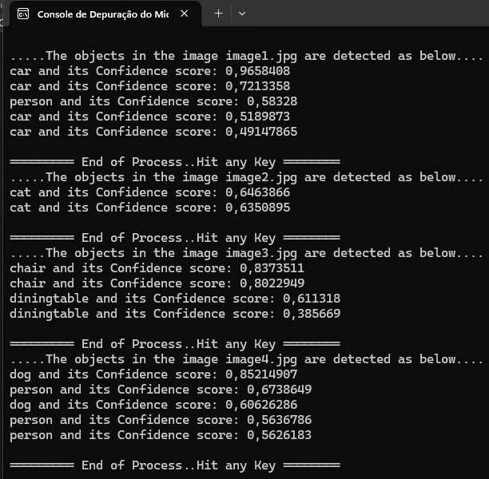

# ObjectDetection

This project is a simply and functional implementation of [Microsoft Tutorial: Detect objects using ONNX in ML.NET](https://learn.microsoft.com/en-us/dotnet/machine-learning/tutorials/object-detection-onnx).

This is the expected result when the program runs:

